# [Credentix 💳](https://credentix.onrender.com/)

**Credit-based payment infrastructure, simplified.** 🚀

Credentix is a credit-based SaaS platform with an enterprise-grade Adyen payment core. Purchase credit bundles, manage your wallet, process transactions, and track everything in real time — all through a modern, fintech-grade interface. 🛡️

---

## What is Credentix? 🤔💳

Credentix demonstrates how to build a credit-based consumption model on top of Adyen's payment infrastructure. Users buy credit bundles, spend credits on API usage or services, and enjoy full visibility into their balance and transaction history. Built with NestJS, React, and Adyen's Drop-in UI, it showcases PCI-compliant card payments, webhook-driven state machines, and a polished admin dashboard for observability. 🔒🔗

Whether you're exploring payment integrations, need a reference for credit-based billing, or want to see Adyen webhooks in action, Credentix makes it straightforward. ✨

---

## 🌐 Try Credentix Live (Staging Environment)

Want to see Credentix in action without setting it up locally?

You can explore the live staging environment here:

👉 **https://credentix.onrender.com/**

The staging environment allows you to:

- 📝 Register and sign in
- 💰 View your wallet balance and recent transactions
- 🛒 Purchase credit bundles with test cards
- 📊 Explore the admin dashboard (admin users)
- 🔗 Experience the full payment flow with Adyen Drop-in

This is a deployed version of the application, so you can get a real feel for:

- The overall user experience
- Secure card payment flow via Adyen
- Real-time balance updates after purchase
- Webhook-driven payment state machine

### 🧪 Test Card Credentials (For Testing Only)

To safely explore the payment flow, use the following Adyen test card credentials:

| Field | Value |
| ----- | ----- |
| **Card Number** | `5100 0600 0000 0002` |
| **Expiry** | `12/29` |
| **CVC** | `737` |

---

> ⚠️ These are Adyen test credentials provided for testing purposes only.  
> Do NOT use real card details in the staging environment.

---

## Key Features 🌟

- **Credit-Based Wallet** 💰 — Purchase bundles, track balance, and spend credits with full transaction history
- **Adyen Payment Integration** 💳 — PCI-compliant Drop-in UI for secure card payments
- **Real-Time Processing** ⏰ — Payments are authorized, captured, and allocated through an event-driven state machine
- **Webhook Architecture** 🔗 — Idempotent webhook processing with HMAC verification and retry handling
- **Admin Dashboard** 📊 — Monitor volume, success rates, payments, and webhook logs
- **Secure by Design** 🛡️🔐 — JWT authentication, role-based access, and enterprise observability

---

## User Journey: Purchasing Credits 🛤️

Buying credits on Credentix takes three simple steps. Select a bundle, enter your card details via Adyen's secure Drop-in, and your wallet is topped up instantly. ⏳

### Step 1: Choose a Bundle 🛒

From the Wallet or Purchase page, select a credit bundle that fits your needs. Each bundle shows price and credit amount clearly. 🖼️

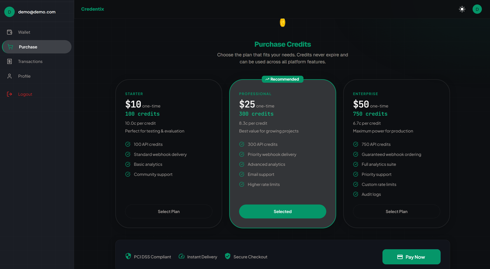
> *[Purchase flow — Bundle selector showing available credit packages with prices]*

---

### Step 2: Enter Card Details 💳

Adyen's Drop-in UI handles the secure card entry. Your card details never touch Credentix servers — they go directly to Adyen. 🔒

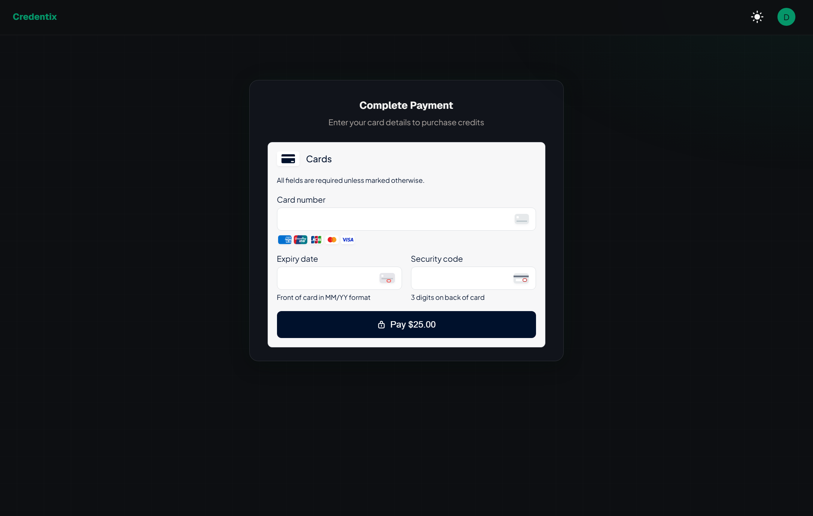
> *[Purchase flow — Adyen Drop-in payment form; user enters test card details]*

Use the test card credentials above to complete the payment in the staging environment. 🧪

---

### Step 3: Confirmation & Balance Update ✅

After a successful payment, you're redirected to a confirmation screen. Your wallet balance updates in real time. 🎉

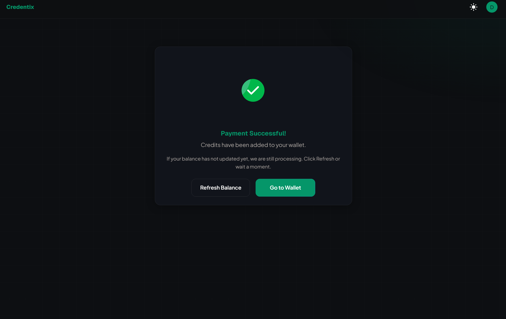
> *[Purchase success — Confirmation screen with updated balance]*

---

## The Credentix Experience ✨

### Landing Page 🏠

The landing page introduces Credentix, highlights features (card payments, real-time processing, webhooks, secure infrastructure), and guides visitors to sign up or sign in. 👋📝

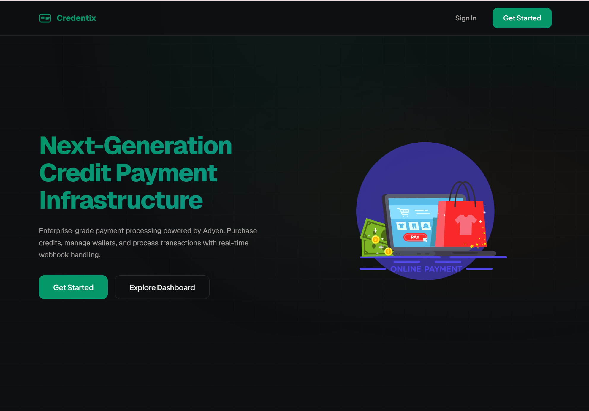
> *[Landing page — Hero section with headline and CTA buttons]*

---

### Sign In & Register 📝

Sign in to your account or create a new one. Clean, minimal forms with secure password handling. 🔐

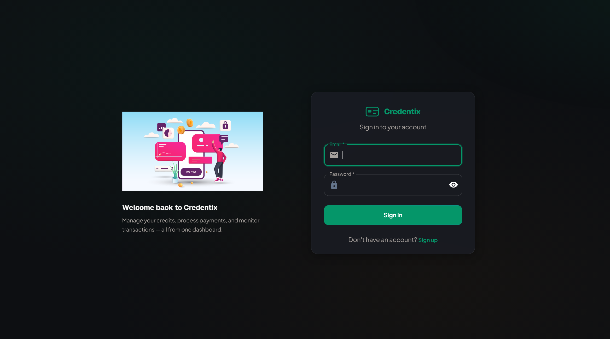
> *[Login page — Sign in form with email and password]*

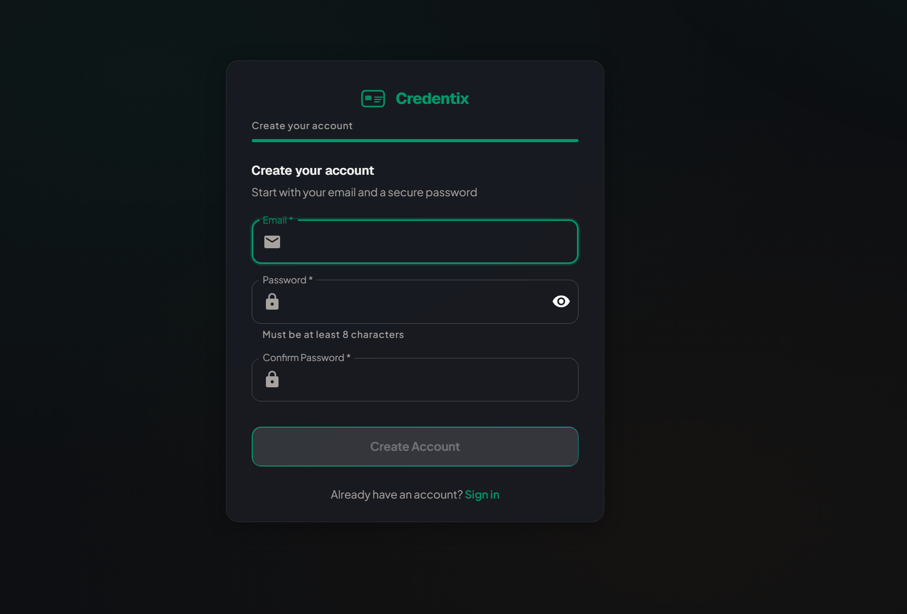
> *[Register page — Create account form]*

---

### Dashboard (Wallet) 📊

Once logged in, the dashboard shows your available balance, transaction count, total credits spent, and recent transactions. Quick access to buy credits and view all transactions. 📈🔗

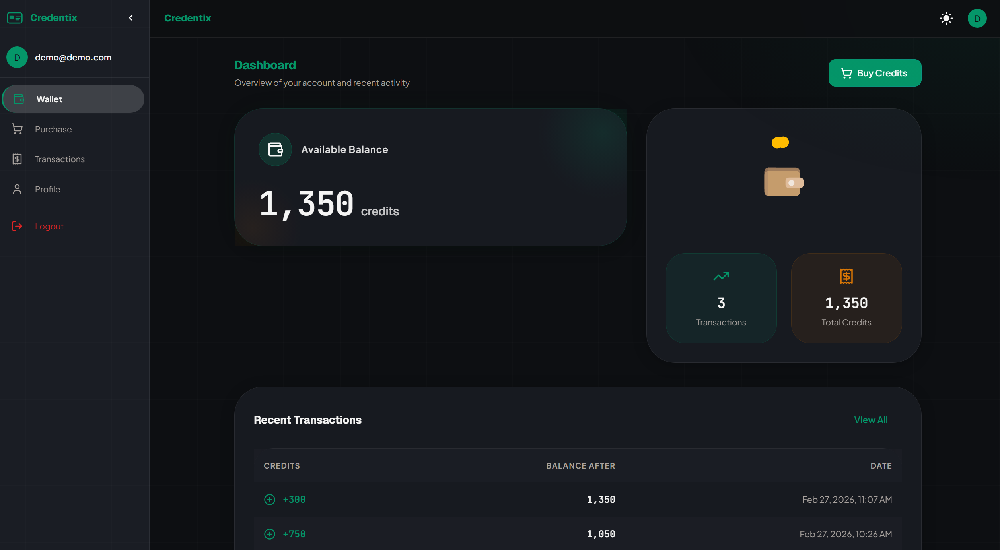
> *[Dashboard — Wallet card with balance, stats, and recent transactions]*

---

### Purchase Credits 🛒

Select a credit bundle and complete payment with Adyen's Drop-in. Bundles are clearly priced with credit amounts. 💳


> *[Purchase page — Bundle selection and payment form]*

---

### Transactions 💸

View your full transaction history: credits added, balance after each transaction, and dates. Filter and browse with a clean, readable layout. 📆➡️📁

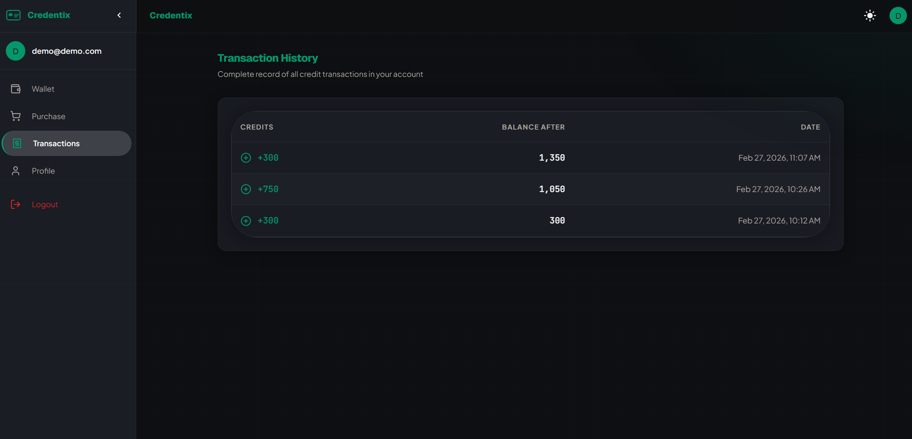
> *[Transactions page — Transaction list with credits, balance after, and date]*

---

### Profile 👤

Manage your profile, update personal details, and upload or change your avatar. 🖼️

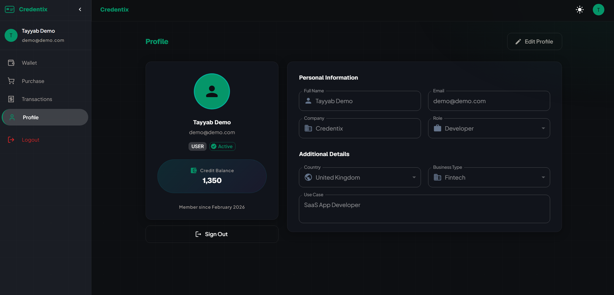
> *[Profile page — User info and avatar management]*

---

### Admin Dashboard 📊 (Admin Users)

Monitor payment metrics: 7-day volume, success rate, pending count, and auth vs capture. View daily volume charts and drill into payments and webhooks. 📈

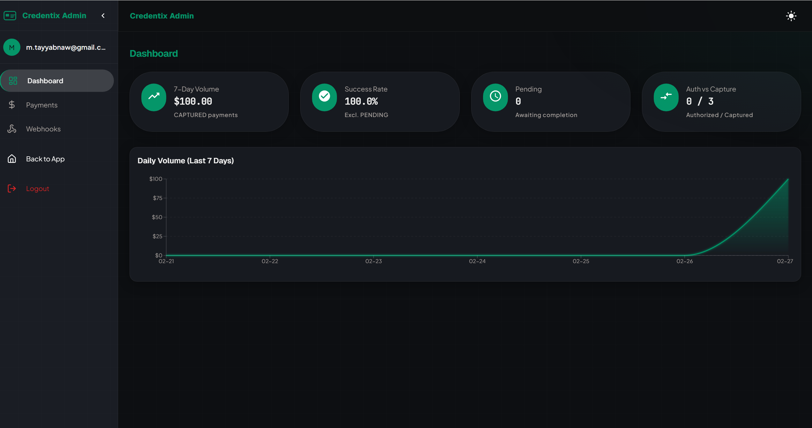
> *[Admin dashboard — Metric cards and volume chart]*

---

### Admin Payments 📋

Browse all payments with status, amount, and links to detail views. Filter by status and search. 🔍

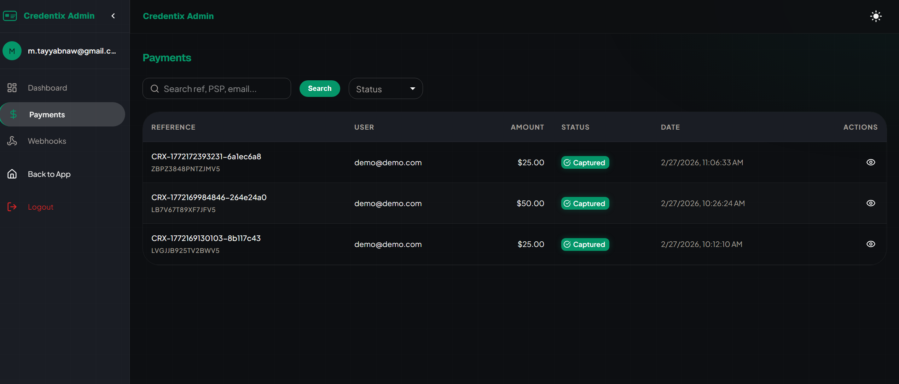
> *[Admin payments — Payment list with status and filters]*

and the below image is the detail view of a payment:


> *[Admin payment detail — Payment detail view]*

---

### Admin Webhooks 🔗

Inspect webhook delivery logs for debugging and observability. 📡

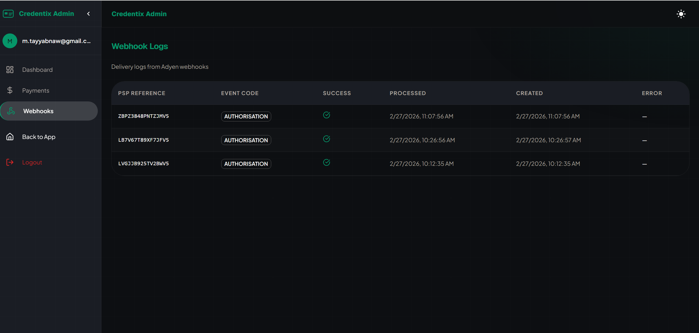
> *[Admin webhooks — Webhook log list]*

---

## Project Setup 🛠️

Everything you need to run Credentix locally or via Docker. 🐳💻

### Prerequisites 📋

- Node.js >= 20 🟢
- PostgreSQL 15+ (or use Docker for the database) 🐘🐳
- npm >= 9 📦

### Local Development ⚡

1. **Clone the repository** 🌀
   ```bash
   git clone https://github.com/TayyabVibin/Credentix.git
   cd Credentix
   ```

2. **Copy and configure environment** 📝
   ```bash
   cp .env.example .env
   # Edit .env with your values (see below)
   ```

3. **Start the database** (if using Docker for Postgres) 🐳🗄️
   ```bash
   docker compose up -d postgres
   ```

4. **Configure `.env`** (root directory) 📝
   - Set `DATABASE_URL` or `DB_HOST`, `POSTGRES_USER`, `POSTGRES_PASSWORD`, `POSTGRES_DB`
   - Add `JWT_SECRET` (e.g. `openssl rand -base64 32`)
   - Set `JWT_EXPIRES_IN` (e.g. `7d`)
   - For payments: `ADYEN_API_KEY`, `ADYEN_MERCHANT_ACCOUNT`, `ADYEN_CLIENT_KEY`, `ADYEN_ENVIRONMENT`, `ADYEN_WEBHOOK_HMAC_KEY`

5. **Configure `frontend/.env`** 💻
   - Set `VITE_API_URL`

6. **Install and run** 🚗
   ```bash
   # Backend
   cd backend && npm install && npm run start:dev

   # Frontend (separate terminal)
   cd frontend && npm install && npm run dev
   ```

   - Frontend: `http://localhost:5173` 🌐  
   - Backend: `http://localhost:3000` 🌐  
   - Swagger API docs: `http://localhost:3000/api/docs` 📚  

### Docker 🐳

All configuration is read from `.env` in the project root. Ensure `DATABASE_URL` or PostgreSQL vars are set. 🗄️

```bash
docker compose up --build
```

Or use the npm script: 🤖

```bash
npm run docker:up
```

---

### 👤 Author

- Name: Muhammad Tayyab
- GitHub: [@TayyabVibin](https://github.com/TayyabVibin)
